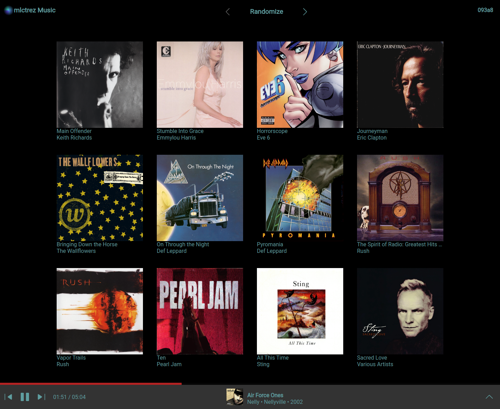

# goapp-audioplayer

Like [music.YouTube.com](https://music.youtube.com) but your music.

Interface is similar but lacks the search / playlist functionality.

## setup

* Rip your CDs using [whipper](https://github.com/whipper-team/whipper) into `~/Music`
* Execute `go run music/index/index.go` to index ripped files into the [bbolt](https://github.com/etcd-io/bbolt) database.
  * Files are indexed into the database expecting [musicbrainz](https://musicbrainz.org/) tags.
* Run the go-app application with `make run`

## screenshot

created by [tigwen](https://github.com/mlctrez/tigwen)
