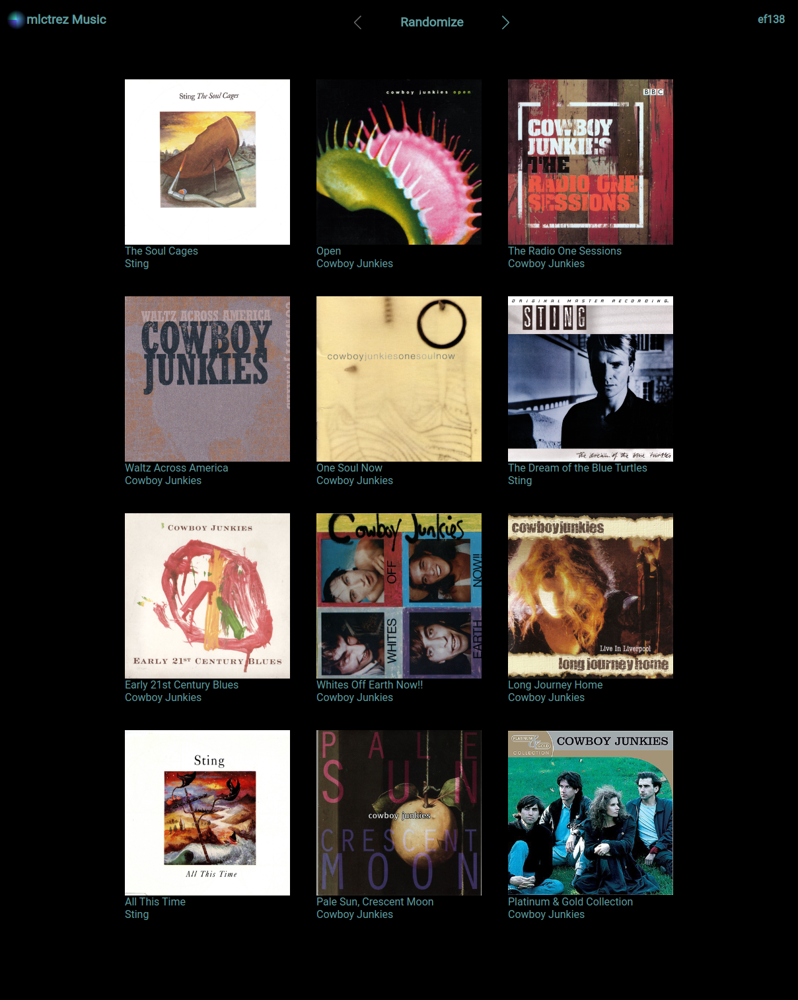

# goapp-audioplayer

Like [music.YouTube.com](https://music.youtube.com) but self-hosted.

Interface is similar but lacks the search / playlist functionality.

## setup

* Rip your CDs using [whipper](https://github.com/whipper-team/whipper) into `~/Music`
  * The app expects [musicbrainz](https://musicbrainz.org/) tags, which are automatically added by whipper.
* Execute `go run music/index/index.go` to index music into the [bbolt](https://github.com/etcd-io/bbolt) database.
  * Flac file tag metadata / size / path / duration is stored in the database. 
  * Album cover art is inserted into the database from [coverartarchive](https://coverartarchive.org/)
* Run the go-app application with `make run`

## screenshots

### Album list 

### Album detail - add whole album or just single tracks

### Queue and audio play / pause / seek controls

created by [tigwen](https://github.com/mlctrez/tigwen)
